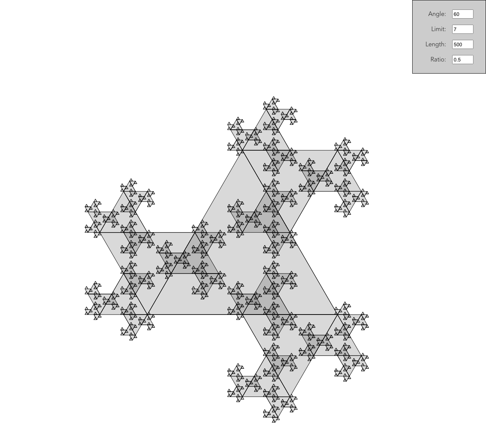

# sierpinski-fractal-generator



## About The Project

As part of my son's collegiate math class, he wanted to create a variation of a [Sierpinski triangle](https://en.wikipedia.org/wiki/Sierpi%C5%84ski_triangle) where the triangles grew outside of the primary triangle rather than being nested within it. We couldn't figure out a programmatic solution before the due date of the project, so he wound up having to draw it by hand.

Some weeks later, I decided to attack the problem as a side-research project to expand my skillset a bit. After a few weeks of beating my head against the keyboard, things finally fell into place, and I was able to generate the same image my son drew by hand. Then, of course, I had to add some features to make it fun to play with.

## Getting Started

This is an example of how you may give instructions on setting up your project locally.
To get a local copy up and running follow these simple example steps.

### Installation

_Below is an example of how you can instruct your audience on installing and setting up your app. This template doesn't rely on any external dependencies or services._

1. Get a free API Key at [https://example.com](https://example.com)
2. Clone the repo
   ```sh
   git clone git@github.com:dkreft/sierpinski-fractal-generator.git
   ```
3. Install dependencies
   ```sh
   yarn
   ```
4. Run the development server
   ```js
   yarn dev
   ```

## License

Distributed under the MIT License. See `LICENSE.txt` for more information.

[screenshot]: public/screenshot.png
